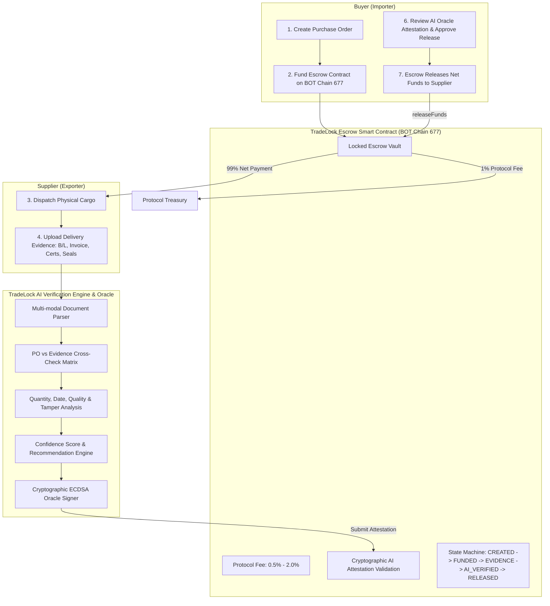

# TradeLock 🛡️⚡
> **Trade without blind trust.**  
> *AI-Powered Onchain Trade Escrow Protocol for International Buyers & Suppliers.*  
> **Built for BOT Chain Builder Challenge #2 — AI × RWA Builder Challenge**

---

## 🌐 1. Non-Negotiable Network Configuration
| Parameter | Mainnet Production Setting |
| :--- | :--- |
| **Network Name** | **BOT Chain Mainnet** |
| **Chain ID** | **677** (`0x2a5`) |
| **RPC Endpoint** | [`https://rpc.botchain.ai`](https://rpc.botchain.ai) |
| **Block Explorer** | [`https://scan.botchain.ai`](https://scan.botchain.ai) |
| **Native Gas Token** | **BOT** |

---

## 💡 The Core Problem & Solution

International trade in real-world commodities (cocoa, coffee, copper, chemicals, grains) faces high counterparty risk:
- **Buyers** fear paying upfront before verifying genuine shipping documents and laboratory quality.
- **Suppliers** fear dispatching multimillion-dollar physical cargo across oceans without guaranteed payment.

**TradeLock** solves this via an intelligent onchain trade escrow protocol:
1. **Purchase Order Creation**: Buyer locks payment (in native `BOT` or ERC-20 stablecoins) into the `TradeLockEscrow` smart contract.
2. **Cargo Fulfillment**: Supplier ships cargo and uploads multi-modal evidence manifests (Bill of Lading, Packing List, SGS/Lab Quality Certificate, Customs Bolt Seal photos, AIS Vessel tracking).
3. **Multi-Vector AI Oracle Verification**: TradeLock AI analyzes evidence against the PO across 5 critical vectors:
   - **Vector 1**: Quantity & Net Weight Reconciliation
   - **Vector 2**: Shipping Lane Transit & Delivery Deadline Timeline
   - **Vector 3**: Cross-Manifest Entity, Container ID & Customs Seal Consistency
   - **Vector 4**: Laboratory Quality Spec & Assay Grading Compliance
   - **Vector 5**: Forensic Tamper, Alteration & Anti-Fraud Scan
4. **Actionable AI Decision**: Generates Confidence Score (0–100%) and recommendation:
   - `RELEASE_FUNDS` (Confidence >= 85%, 0 critical anomalies)
   - `REQUEST_REVIEW` (Confidence 60–84%, minor port delay or non-critical spec variance)
   - `FLAG_DISPUTE` (Confidence < 60%, cargo shortfall, tampered seal, forged documents)
5. **Onchain Attestation & Settlement**: AI Oracle signs attestation via ECDSA. With Buyer approval, `TradeLockEscrow` releases net funds (99.0%) to the supplier and retains a 1.0% protocol fee (configurable 0.5%–2.0%).

---

## 🏛️ System Architecture



---

## 🔬 Preloaded RWA Trade Packages (Judge Quick-Start)

The application comes pre-loaded with authentic international trade scenarios ready for immediate evaluation:

1. **Case A: Clean Delivery (10 MT Organic Ivory Coast Cocoa — $18,000)**
   - *Evidence*: Bill of Lading, SGS moisture 6.8%, matching container seals `MSKU-948271-0`.
   - *AI Score*: **96% Confidence**
   - *Decision*: **`RELEASE_FUNDS`**
2. **Case B: Minor Variance (20 MT Vietnamese Robusta Coffee — $24,000)**
   - *Evidence*: 3-day vessel delay due to maritime traffic, moisture 12.8% vs 12.5% max target.
   - *AI Score*: **76% Confidence**
   - *Decision*: **`REQUEST_REVIEW`**
3. **Case C: Forgery & Deficit (50 MT Chilean Copper Cathodes — $45,000)**
   - *Evidence*: 8.5 MT weight deficit (17% missing cargo), forged B/L seal, container number mismatch between B/L and packing list.
   - *AI Score*: **28% Confidence**
   - *Decision*: **`FLAG_DISPUTE`**

---

## 🚀 Quickstart & Running Locally

### 1. Install & Test Smart Contracts
```bash
cd contracts
npm install
npm test
```

### 2. Deploy to BOT Chain Mainnet 677
```bash
# Configure your private key in contracts/.env or pass directly:
npm run deploy:botchain
```

### 3. Start AI Engine & Backend Server
```bash
cd server
npm install
npm start
# Runs on http://localhost:5000
```

### 4. Start Frontend dApp
```bash
cd Tradelock-frontend
npm install
npm run dev
# Open http://localhost:5173 in your browser
```

### 5. Build for Production
```bash
cd Tradelock-frontend
npm run build
```

---

## 🚀 Deploying to Vercel

1. **Push repository to GitHub**:
   ```bash
   git init
   git add .
   git commit -m "feat: complete TradeLock protocol & frontend on BOT Chain Mainnet"
   git branch -M main
   git remote add origin <your-github-repo-url>
   git push -u origin main
   ```

2. **Import to Vercel**:
   - Set **Root Directory**: `Tradelock-frontend` (or leave default if using root `vercel.json`).
   - Set **Framework Preset**: `Vite`.
   - Set **Build Command**: `npm run build`
   - Set **Output Directory**: `dist`
   - Add Environment Variables (from `Tradelock-frontend/.env.example`):
     - `VITE_BOTCHAIN_RPC_URL`: `https://rpc.botchain.ai`
     - `VITE_BOTCHAIN_CHAIN_ID`: `677`
     - `VITE_BOTCHAIN_EXPLORER_URL`: `https://scan.botchain.ai`
     - `VITE_ESCROW_CONTRACT_ADDRESS`: `0xd77d14697bCC9D0a6DCA234b8612D3C0A5ae89eb`
     - `VITE_PAYMENT_TOKEN_ADDRESS`: `0x0E965EAe12631A0826518e1811df9953355995fF`
     - `VITE_AI_ORACLE_ADDRESS`: `0x34090545BD562b0bE1Cdc855F7cA9beE4566CE51`
     - `VITE_API_BASE_URL`: `<your-deployed-backend-url-or-leave-default>`

---

## 📜 Smart Contract Highlights
- **`TradeLockEscrow.sol`**:
  - ReentrancyGuard, Ownable, Pausable
  - Multi-asset support (Native BOT token and ERC20 tokens)
  - Configurable fee boundary: 50 bps (0.5%) to 200 bps (2.0%)
  - ECDSA signature verification for gasless or relayer AI Oracle attestations
  - Buyer safety timeouts and expired refund protections
  - Comprehensive onchain events for indexers

---

## 🏆 Hackathon Submission Metadata
- **Track**: AI × RWA (Builder Challenge #2)
- **Primary Chain**: BOT Chain Mainnet (Chain ID 677)
- **License**: MIT

